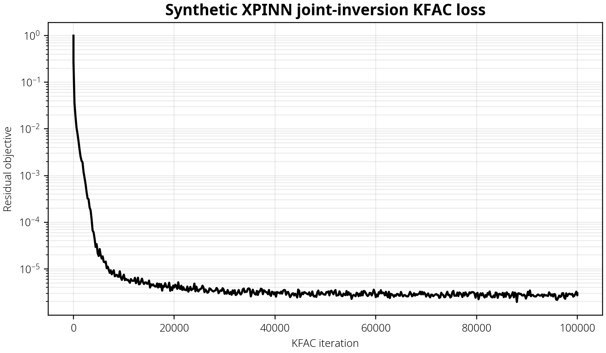
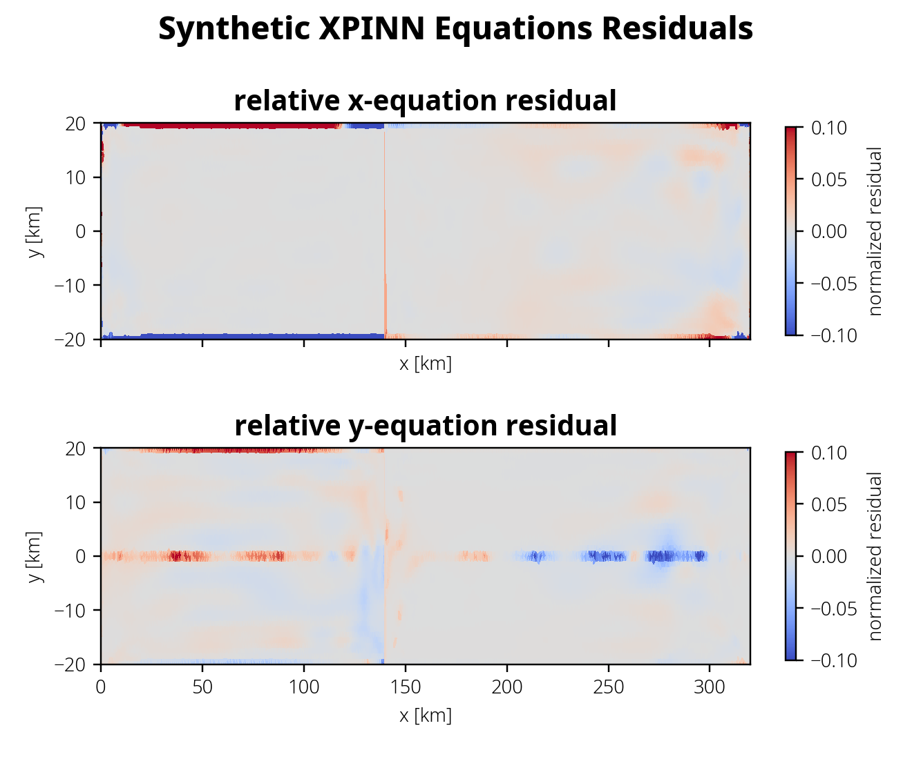
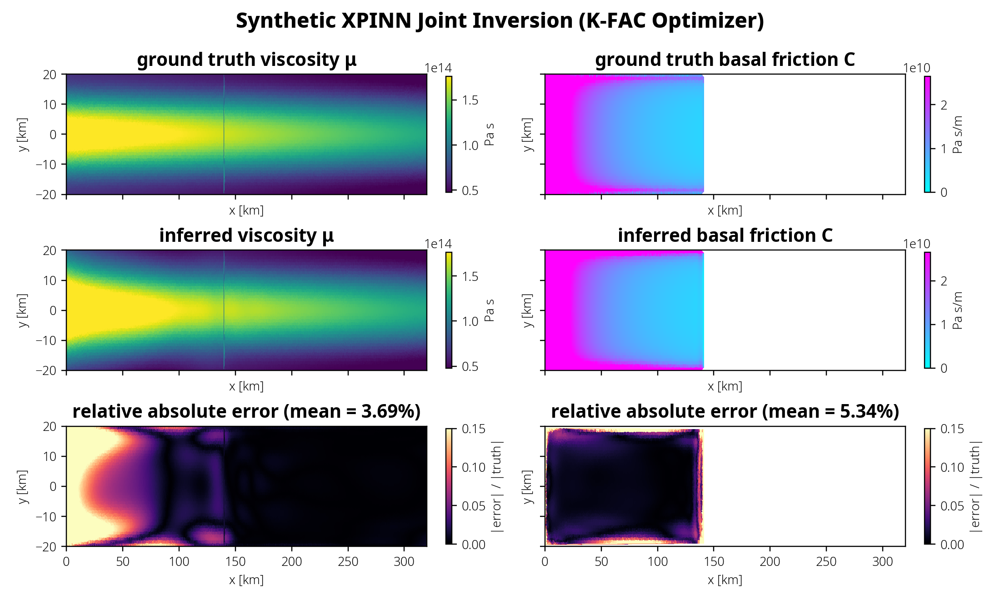
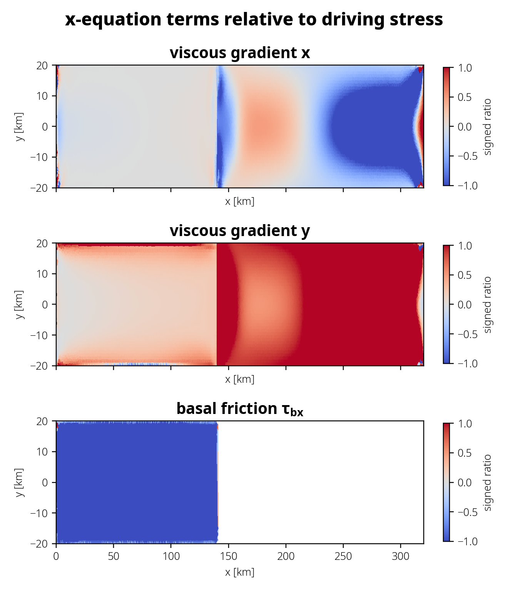

*For documentation of the previous version of DIFFICE_jax, refer to [YaoGroup/DIFFICE_jax](https://github.com/YaoGroup/DIFFICE_jax). This fork will be merged into this previous version when development is fully complete.* 

# Synthetic Joint Inversion of Viscosity and Friction

### Problem Formulation 
The Shelfy-Stream/Shallow-Shelf Approximation (SSA) to the Stokes equations are appropriate for fast flowing ice streams in Antarctica and are given by

$$ g_1=[2\mu h(2u_x + v_y)]_x + [\mu h(u_y + v_x)]_y - \tau_{bx} - \rho g h s_x $$
$$ g_2=[2\mu h(u_x + 2v_y)]_y + [\mu h(u_y + v_x)]_x - \tau_{by} - \rho g h s_y $$

For simplicity, we can write $\tau_{bx}=Cu$ and $\tau_{by}=Cv$. For floating ice shelves, the analogous equations are given by 

$$f_1 = [2\mu h(2u_x + v_y)]_x + [\mu h(u_y + v_x)]_y - \rho g h(1-\rho_i/\rho)h_x$$
$$f_2 = [2\mu h(u_x + 2v_y)]_y + [\mu h(u_y + v_x)]_x - \rho g h(1-\rho_i/\rho)h_y$$

where subscripts denote derivatives, $u,v$ are the horizontal velocities, $h$ the thickness, $s$ the surface elevation, $\rho$ the density of glacial ice, $\mu$ its viscoisty, and $\tau_{bx}, \tau_{by}$ are the basal tractions. Note that these floating equations assume a constant density profile along depth. An improved model using a more realistic, depth-varying depth is under development.

Now suppose that $q^\theta$ denotes a field parametrized by neural networks with parameters $\theta$. The joint inversion problem may be formalized as 

$$ \theta = \text{argmin}_{\tilde\theta} \bigg[\sum_{i=1}^{N_{uv}}{[(u_i^\theta-u_i^{obs})^2 + (v_i^\theta - v_i^{obs})^2]} + \sum_{i=1}^{N_h}{(h_i^\theta-h_i^{obs})^2} + \sum_{i=1}^{N_s}{(s_i^\theta-s_i^{obs})^2} + \sum_{i=1}^{N_{col}} [(f_{1i}^\theta)^2 + (f^\theta_{2i})^2 + (g^\theta_{1i})^2 + (g^\theta_{2i})^2] + \sum_{i=1}^{N_{g}}\text{Match}_i + \sum_{i=1}^{N_{c}}\text{BoundaryCondition}_i\bigg] $$

where $\text{Match}$ requires continuity of the fields, their derivatives, and/or their second derivatives at the junction between the ice sheet and the ice shelf (grounding line), and $\text{BoundaryCondition}$ is the pressure balance condition evaluated at the ice-shelf-ocean terminus.  Given observations (superscript "obs"), we may solve the inverse problem for $\mu^\theta(x,y)$ and $C^\theta (x,y)$. This approach of training neural networks for different regions and stitching them together is a domain decomposition method referred to as extended PINNs (X-PINNs).

### Proof of Concept  
<small>*Ice stream coupled with ice shelf, gPINN-regularized K-FAC optimization for 100,000 iterations*</small>

A synthetic example of this problem is solved below. From the loss curve, we see that the X-PINN has been trained to convergence (loss curve plateaus). In the spatial plots of the inferred $\mu$ and $C$ fields (only grounded part is displayed for $C$), however, we also observe that the mean absolute error (MAE) between the inferred viscosity and the ground truth viscosity remains rather large over the grounded region (ice stream, left), while it is very small over the floating region (ice shelf, right). On the other hand, the friction coefficient has been inferred very well, with mismatches mainly focused in the shearing boundaries where velocities $(u, v)$ and therefore basal friction $(\tau_{bx}, \tau_{by})$ is near zero. This is a result of the parametrization of friction used in the synthetic simulation, and may not represent actual glacial systems. 

Nevertheless, there is a puzzle. Judging from the plots of the relative equation residuals $f_1$, $f_2$, $g_1$, $g_2$ (divided by the largest term in each respective expression), the equations are solved very well to a large extent. How can the equation residuals be small, the friction coefficient $C$ be accurately inferred, but the viscosity mismatch remain rather large?








A distinct advantage of PINNs over finite element methods is that we can evaluate the hard-form equation residuals effortlessly, since PINNs are in principle smooth functions of $x$ and $y$. Finite element fields on the other hand are only once-differentiable by construction. An analysis of the different terms in the SSA equation reveals that viscosity simply is not very important in the stress balance over the ice stream. 

Here we focus on the x-component of the SSA equation, as the primary flow direction of our synthetic system is in the x direction. We can immediately observe that the viscous gradient terms are much, much smaller (~ O(0)) compared to the basal friction (~O(1)) relative to the driving stress term (the four terms should sum to zero). This means that, to satisfy stress balance over the grounded ice stream, the x-viscous-gradient term contributes almost no constraints! The PINN actually accomplished an impressive fit here, that it successfully identified ~O(0) terms without any prior knowledge of the system other than the governing equations.

On the other hand, we see that the y-viscous-gradient is of ~(O(1)) but of the opposite sign near the boundaries, where the shear strain rates are large. This means that it is really the y-viscous-gradient in the x-SSA equation that contributes information about viscosity. Otherwise, obtaining the viscosity simultaneously with the friction may be even more challenging. This simple study tells us, in some way, good news because it means that viscosity (highly uncertain) may not be so important in certain ice streams.

The caveat here is that a power-law friction parametrization was used to generate the synthetic simulation, which creates large basal friction even near the grounding line. If the basal friction were weak near the grounding line, viscosity will have to become important because the viscous gradients need to be large to satisfy the stress balance. Running the algorithm on a regularized coulomb example is subject for future work. 



# Governing Equations Incorporating Depth-Dependent Density 
The equations for floating ice above assume that ice shelves have density $\rho$ throughout its depth but this is not true. The next level of complexity uses a compaction model (Cuffey and Patterson, 2010)

$$ \rho(z) = \rho_i - (\rho_i - \rho_s) e^{-k(s-z)}$$

so that $\rho(z=s)=\rho_s$ at the surface and $\rho(z=b)\approx\rho_i$ at the base of the ice shelf. $\rho_i=917$ kg/m^3 and $\rho_s=400$ kg/m^3 are densities of glacial ice and uncompacted snow, respectively. The $k$ is the unknown compaction rate that needs to be calibrated from surface elevation data. The incorporation of this density model into the governing equations ($f_1$, $f_2$) is subject of ongoing work.

# Config-driven inversion workflow

A major change since v1.0.3 is the abstraction of many hand-crafted code logic behind a user-friendly interface that simply takes in YAML config files to run inversions. The user needs only to prepare the raw data to feed into DIFFICE and configure the runtime and training options. `examples/run_inversion.py` is the config-driven entry point for running `DIFFICE_jax` inversions through the
high-level `DIFFICESolver` workflow API.  It replaces hand-edited training scripts with a YAML file that specifies
the data source, model type, loss terms, optimizer, runtime settings, and output location.

The example shown above was produced by
`examples/synthetic_data/configs/xpinn_joint_flatbed_kfac_col2056_100k_gpu.yaml`, which runs a two-region XPINN
joint inversion on the synthetic flatbed data using KFAC.
The YAML examples below follow the same settings, with relative paths written for configs stored in
`examples/synthetic_data/configs/`.


When called with a YAML config, `run_inversion.py`:

1. reads the config and applies optional JAX runtime settings before importing the full solver stack;
2. loads the `.mat` training data specified by `data.source`;
3. prints dataset and batch point counts for velocity, thickness, surface, collocation, calving-front, and interface data;
4. builds a `DIFFICESolver` from the `data`, `model`, `equation`, `loss`, and `training` sections;
5. runs each optimizer stage in order;
6. saves solver artifacts unless `--no-save` is passed;
7. renders the standard XPINN figure set into `<output_dir>/plots` unless `--no-plot` is passed (automatically skipped for `--no-save` runs and non-XPINN workflows).

Relative paths in the YAML file are resolved relative to the directory containing that YAML file.  For example, a
config stored in `examples/synthetic_data/configs/` should refer to the flatbed dataset as:

```yaml
data:
  source: ../flatbed_data_xpinns_regression_test.mat
```

### YAML structure

A workflow config has these main sections:

- `name`: label printed in logs and used as the default artifact tag.
- `workflow`: public workflow name. Common values are `ice-shelf-only` for PINNs and `joint_inversion` for XPINNs.
- `runtime`: optional JAX platform and compilation-cache settings.
- `data`: input `.mat` path and sampling counts.
- `model`: PINN or XPINN model structure and network size.
- `equation`: PDE and boundary-condition choice.
- `loss`: loss type and active loss terms.
- `training`: random seed, global weights, and one or more optimizer stages.
- `artifacts`: output directory for saved parameters, predictions, and loss history.

Refer to `examples/synthetic_data/configs/xpinn_joint_flatbed_kfac_col2056_100k_gpu.yaml` for an example.

Run it with:

```bash
python examples/run_inversion.py \
  examples/synthetic_data/configs/xpinn_joint_flatbed_kfac_col2056_100k_gpu.yaml
```

Submit it to SLURM with:

```bash
sbatch examples/submit_run_inversion.sbatch \
  examples/synthetic_data/configs/xpinn_joint_flatbed_kfac_col2056_100k_gpu.yaml
```

### Ice-Shelf-Only workflow

The behavior in DIFFICE v1.0 can be recovered by specifying `workflow: ice-shelf-only` and `model.workflow: pinn`, with scalar sampling counts.

### Notes

- `data.source`, optimizer checkpoint paths, and `artifacts.output_dir` are resolved relative to the YAML file.
- XPINN sampling counts can be per-region lists, for example `[1028, 1028]`.
- PINN sampling counts are scalar.
- Current samplers require `surface_data` to match `thickness_data` when surface data are used.
- KFAC runs should use the CPU or GPU environment that has `kfac_jax`; GPU configs should set `runtime.jax_platform: cuda`.
- Use `--no-save` for build checks, smoke runs, and timing runs where saved artifacts are not needed.
- Plots are rendered automatically after a saved XPINN run; pass `--no-plot` to skip them, or run `examples/render_solver_xpinn_kfac_plots.py` later to regenerate them from a saved solver directory.
